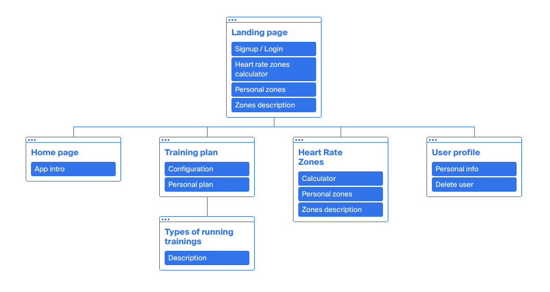

# REDI Sprint 2020 Frontend Development 2, Final Project

Application Name: ReDI-Run-App

Student Name: Natalia Gubanova

## ReDI-Run-App

App to configure your personal running plan and track its completeness. Calculates your approximate heart rate zones which helps you to focus in on different training intensities.

## Screenshots

- Sitemap:

## Features:

- Calculation of approximate heart rate zones
- Configuration of personal running training plan
- Track its completeness

## How to setup and run ReDI-Run-App

1. Clone repository to your computer
   - with HTTPS `git clone https://github.com/redi-js-teachers/js_sprint_2020_final_project_khomtali.git`
   - with SSH `git clone git@github.com:redi-js-teachers/js_sprint_2020_final_project_khomtali.git`
1. Go to the project directory `cd js_sprint_2020_final_project_khomtali`
1. Create .env file with a constant `REACT_APP_BACKEND_URL=https://redi.travisshears.xyz/api/run/v1/`
1. Then run `npm install` and wait for installing all modules
1. Run `npm start` and enjoy :)

---

*[create-react-app README.md](docs/React_README.md)*
