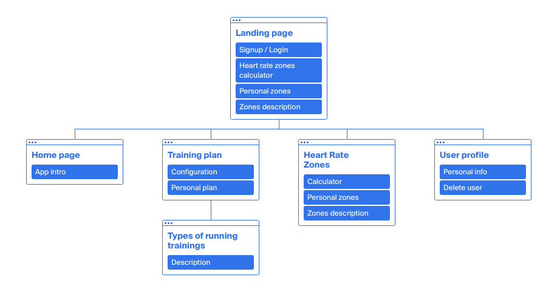
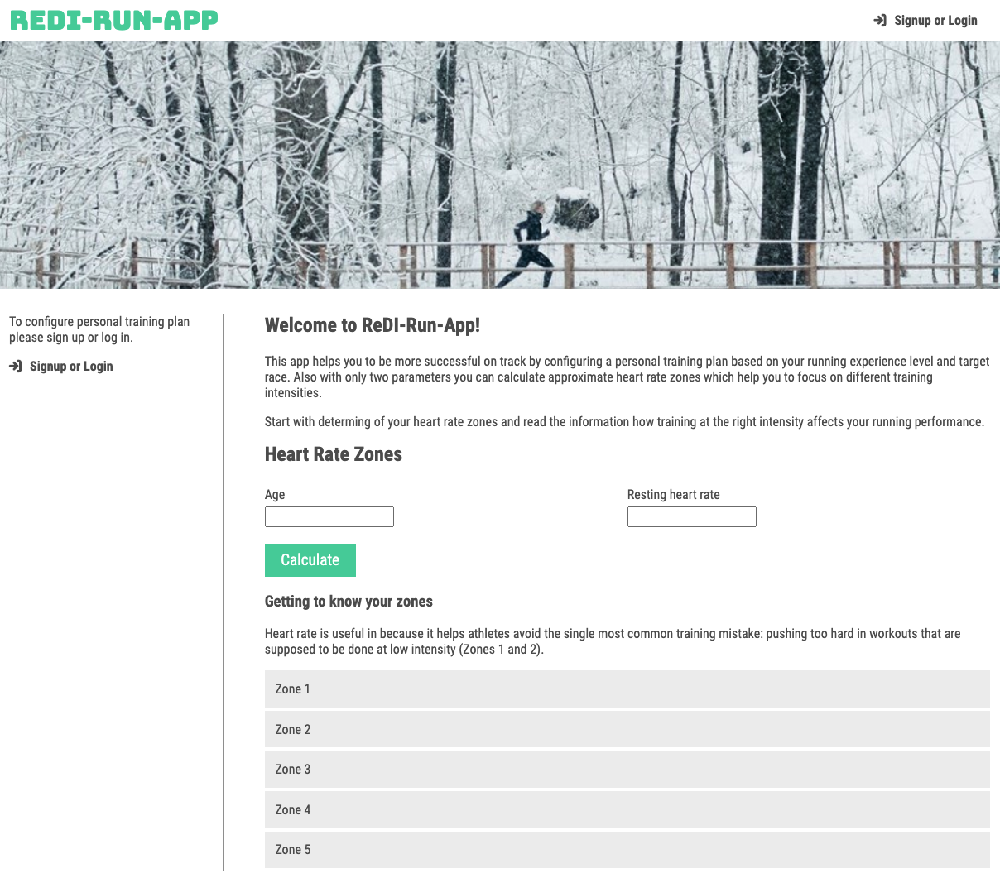
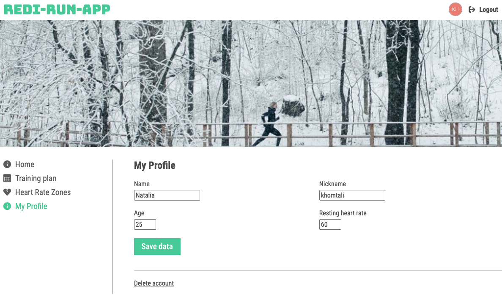
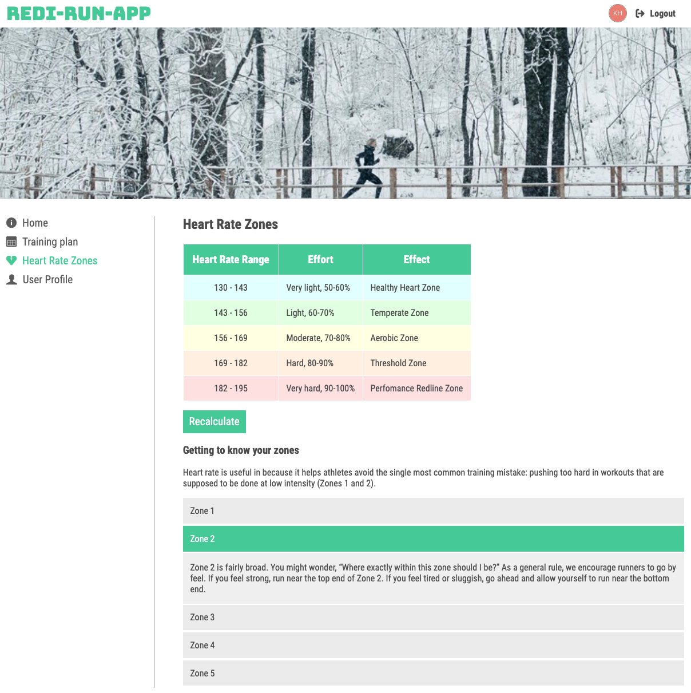
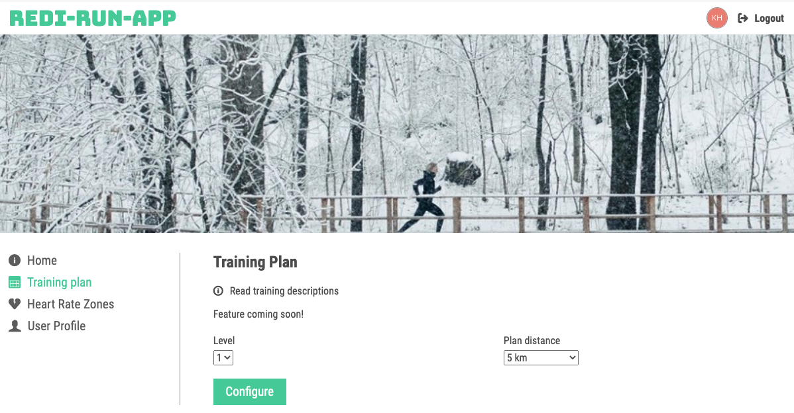

# ReDI Spring 2020 Frontend Development 2, Final Project

Application Name: ReDI-Run-App

Student Name: Natalia Gubanova

## ReDI-Run-App

App to configure your personal running plan and track its completeness. Calculates your approximate heart rate zones which helps you to focus in on different training intensities.

## Screenshots

- Sitemap:

- Homepage:

- User Profile Page:

- HR Zones Calculator Page:

- Training Plan Page:

## Features:

- Calculation of approximate heart rate zones
- Configuration of personal running training plan
- Track its completeness

## How to setup and run ReDI-Run-App

1. Clone repository to your computer
   - with HTTPS `git clone https://github.com/khomtali/run_app.git`
   - with SSH `git clone git@github.com:khomtali/run_app.git`
1. Go to the project directory `cd run_app`
1. Install Node.js 20.19 or newer
1. Run `npm install`
1. Run `npm start` and open the local URL shown in the terminal

## Quality checks

- `npm test` runs the test suite once
- `npm run build` creates a production build in `dist/`
- `npm audit` checks the installed dependency tree for known vulnerabilities

---

*App is built as single-page-application using ReactJS.*

*The application is built with [Vite](https://vite.dev/) and React.*
